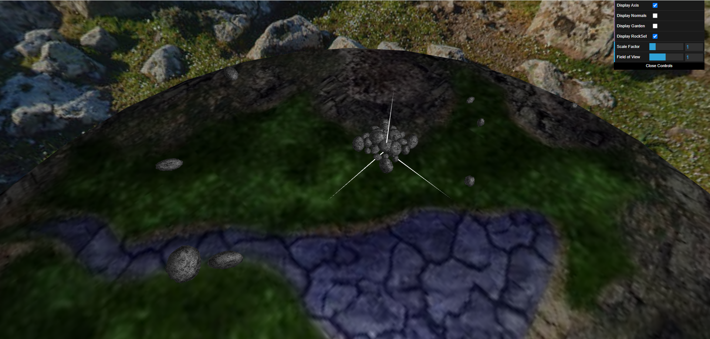

# CG 2023/2024

## Group T08G04

| Name              | Number    | E-Mail               |
| ----------------- | --------- | -------------------- |
| Diogo Santos      | 202009291 | <up202009291@up.pt>  |
| Miguel Figueiredo | 201706105 | <up201706105@up.pt>  |

## Project Notes

### Sky Sphere

### Panorama

### Implemented Fov Slider

### Flower Garden

### Rocks

- We still have the branch `Rock/Rockset` that contains the implementation of the rocks. Merging it to the main branch was proving to be difficult due to the changes in the main branch so we decided to just copy the changed files to the main branch.

### Rock Pile

### Bee

### Pollen

- The bee will not automatically aproach neither the pollen nor the beehive. The user has to manually move the bee to the pollen or the beehive, unfortunately.

### Beehive

### Grass

- The grass is not using shaders like it was supposed to. We tried to implement it but we were not able to do it in time.

