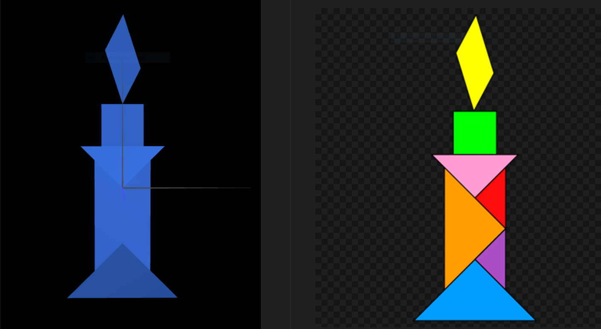
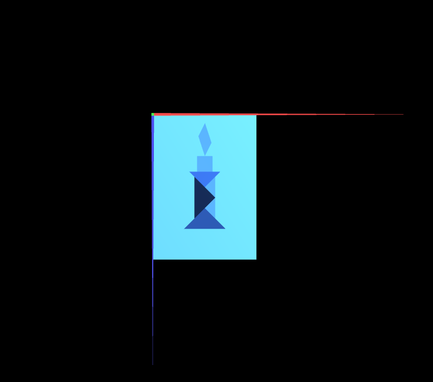
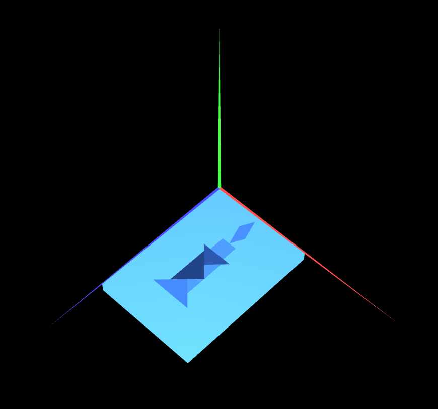
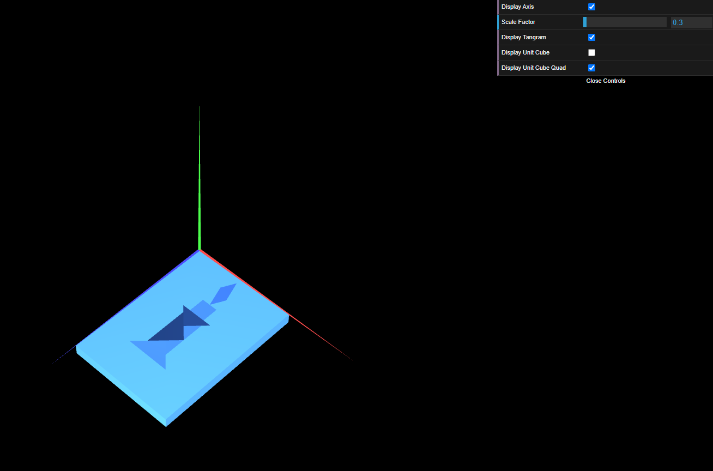

# CG 2023/2024

## Group T08G04

## TP 2 Notes

- While creating the Tangram, we had some difficulties using the recommended funtions for this was our first time working with them, but, as soon as we created the first mirrored object, the rest was pretty smooth sailing.

- The last object we created was the parallelogram and we left it for last because of the weird rotating angle we knew it would need.

### Tangram

- The unitary cube itself was easy to draw and placing an upscaled version of it behind the Tangram was not a challenge. The hard part was making both objects move and rotate at the same time without undoing what was already done.

### Unitary Cube and Tangram

#### Sky View

#### Angled View

- Creating a square and then rotating it to create another cube was tedious but not hard. And since we alredy had the code needed to transform this new cube, we just had to insert the call to display the new cube right below the call for the first one and voilà, we had two identical cubes in the same place.

### Unitary Cube composed of planes and Tangram

