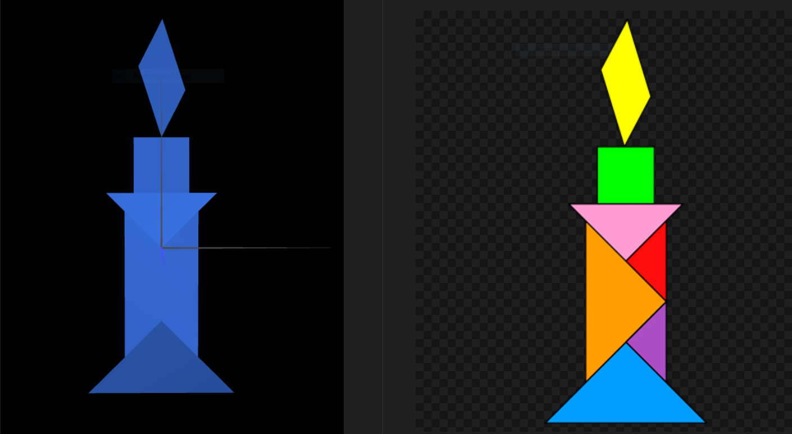

# CG 2023/2024

## Group T08G04

## TP 2 Notes

- While creating the Tangram, we had some difficulties using the recommended funtions for this was our first time working with them, but, as soon as we created the first mirrored object, the rest was pretty smooth sailing.

- The last object we created was the parallelogram and we left it for last because of the weird rotating angle we knew it would need.

### Tangram

