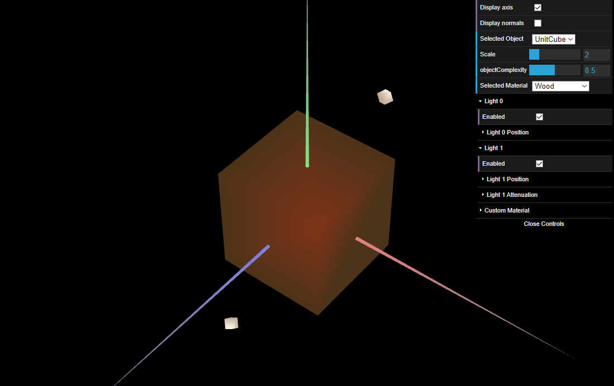
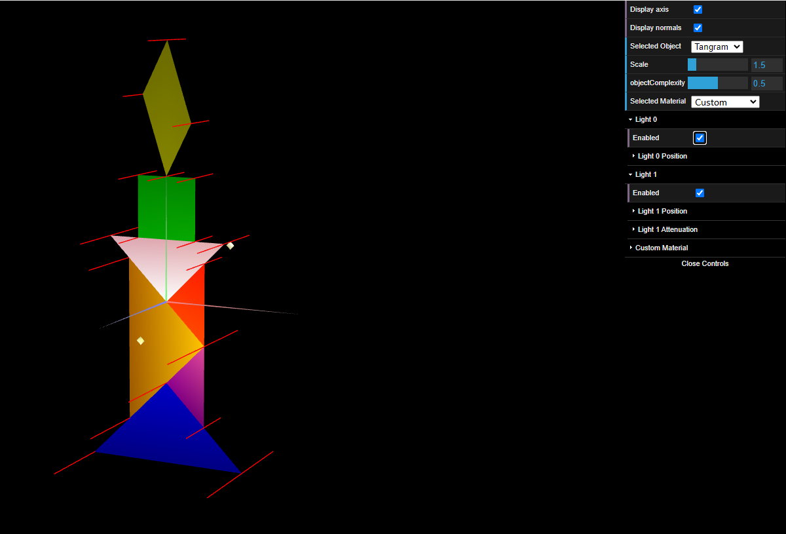
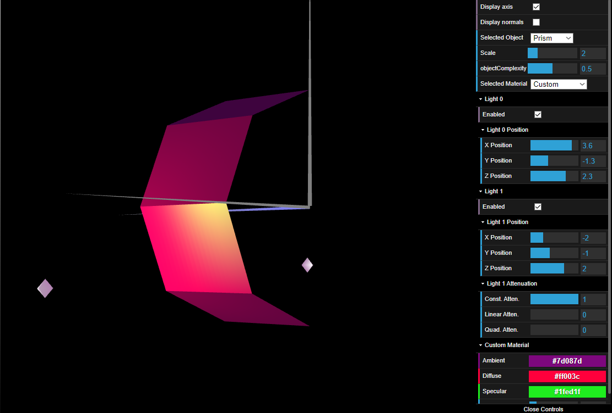

# CG 2023/2024

## Group T08G04

## TP 3 Notes

- We had difficulties on watching the effects light on the different components of the tangram because some of its pieces were interconnected

- While creating the Prism, we had some difficulties creating the algorithm to create the vertices and creating the normals for each vertex

In the first exercise we created the normals for the figures we've done on previous TP's so that the calculated luminosity made sense according to the angle of incidence of the light and the viewing angle. We also created a material similar to wood with a low specular component.

### WoodCube

Still in exercise 1, we applied several materials with a high specular component to the figures present in the tangram.

### Tangram

In exercise 2 we built a prism with a variable number of sides and complexity. The most challenging part was implementing the most efficient algorithm possible to create vertices, describe the triangle mesh and create normalized normals at each vertex. The calculated lighting was similar to that calculated with Constant Shading since the normals for the same face are the same.

### MyPrism

In exercise 3, the normals were placed perpendicular to each edge. This reduces the number of vertices and normals to be calculated. As expected, the lighting transitions on the edges were softened, becoming less apparent and giving a curved appearance to the surface of the previous prism.
