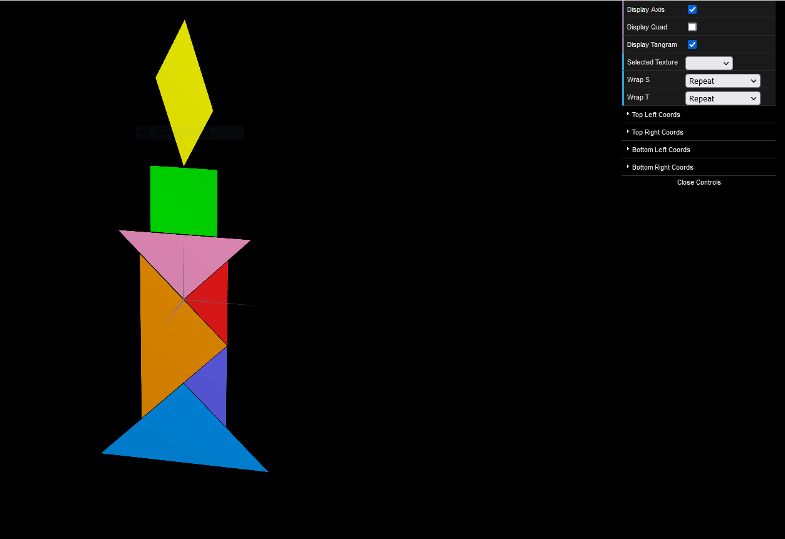

# CG 2023/2024

## Group T08G04

## TP 4 Notes

### Tangram

- In the first exercise we were asked to apply the corresponding texture in the `tangram.png` file to each object that makes the tangram. Matching the texture coordinates with the object's was a bit hard and we were only able to do it by trial and error.

---

### Placeholder

- Placeholder

