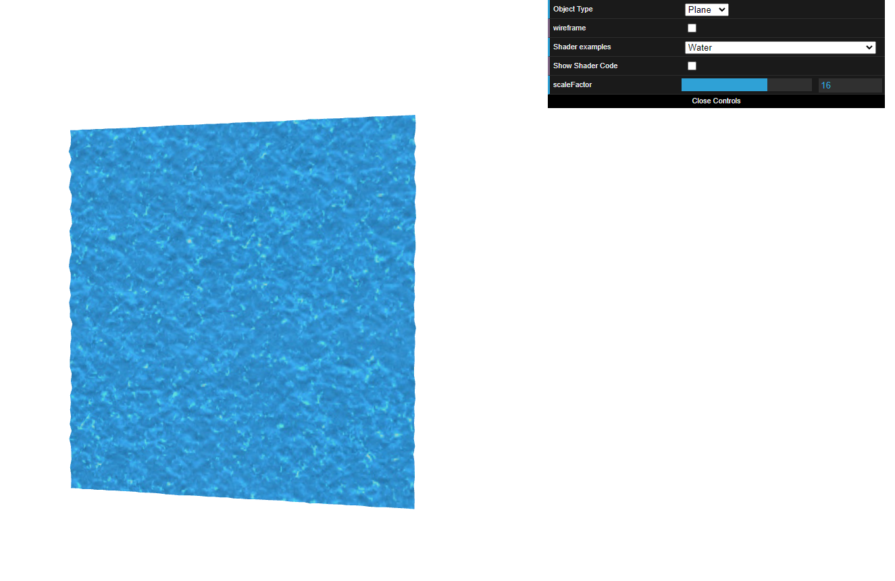

# CG 2023/2024

## Group T08G04

## TP 5 Notes

### Varying Teapot

- It was kind of hard to make sense of what we were doing at first, since this was the first time we worked with shaders, but it then clicked and everything went smoothly.

---

### Grayscale Teapot

### Water Plane

- Implementing the water plane was a bit tricky but by asking for help and reading the documentation we were able to get it working.

